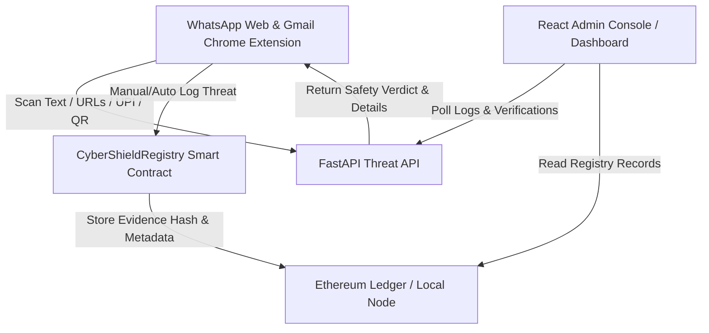

# CyberShield: Digital Policing & Cross-Station Cyber Complaint Linkage Platform

CyberShield is an intelligent, real-time digital policing console and web extension designed to combat digital scams, phishing campaigns, and financial fraud. The platform features a **Cross-Station Cyber Complaint Linkage & Fraud Pattern Intelligence Console** that automatically correlates isolated complaints across police jurisdictions using shared digital evidence (like UPI IDs and phishing links). It intercepts inbound threats, applies multi-signal verifications, tracks victim reports geographically, and creates immutable logs of threat evidence on a blockchain ledger.

---

## 1. Focus Area Alignment

| Key Focus Area | Current Implementation | Status |
| :--- | :--- | :--- |
| **Financial Fraud Detection** | Parses UPI URI links, validates display name alignment, parses bank accounts/IFSCs, and verifies them against the Mule database. | **Implemented** |
| **Phishing & Scam Detection** | Implements typosquatting analysis, WHOIS registration age checks, SSL certificate handshakes, and algorithmic DGA scanners. | **Implemented** |
| **Cyber Complaint Classification** | Hybrid NLP classification engine utilizing TF-IDF cosine similarity and Google Gemini AI fallback. | **Implemented** |
| **Fake Identity Detection** | Flags email display name spoofing in Gmail and highlights WhatsApp messages from high-risk country codes. | **Implemented** |
| **Digital Threat Monitoring** | real-time Chrome Extension scanner paired with a centralized digital policing console (Vite/React) and Solidity blockchain ledger. | **Implemented** |

---

## 2. Platform Architecture

### A. Real-Time Browser Extension
* **Reactive DOM Scanner**: Uses a `MutationObserver` in `extension/content.js` to parse chat bubbles on WhatsApp Web and emails on Gmail as they load.
* **Extraction Engine**: Extracts URLs, raw bank accounts/IFSCs, UPI links, and base64 QR codes.
* **Badges & Warning Shields**: Injects visual warning indicators (`🛡️ MALICIOUS` / `🛡️ SUSPICIOUS`) and tooltips explaining threat details.

### B. Python FastAPI Threat API
* **Hybrid Text Classifier**: Combines local TF-IDF cosine similarity vector indexing with Gemini-1.5-Flash model support for intent classification.
* **Mule Account Database**: Cross-references parsed bank accounts/IFSCs and UPI handles against `mule_accounts.json`.
* **Active Domain Verifier**:
  * **WHOIS Age**: Queries RDAP servers (`https://rdap.org`) to block domains under 30 days old.
  * **SSL Checker**: Connects to port 443 to inspect certificate trust and handshakes.
  * **DGA Classifier**: Calculates Shannon entropy and digit ratios to catch randomly generated strings.
* **QR Matrix Decoder**: Decodes base64 QR codes using OpenCV.

### C. On-Chain Ledger & Administration Console
* **Solidity Smart Contract**: `CyberShieldRegistry.sol` seals threat metadata (target, category, evidence hash, reporter) on-chain.
* **NCRP Complaint Generator**: Converts feed items into printable official Cyber Crime FIR complaint forms pre-populated with forensic hashes and transaction receipts.
* **Geographic Threat Heatmap**: A custom glassmorphic SVG visualizer tracking regional threat density.
* **Incident Timeline Visualizer**: Displays a step-by-step forensic verification audit of selected threats.

---

## 3. Detailed Checklist & Progress

### Area 1: Financial Fraud Detection
* [x] **Bank Account & IFSC Validation `[FACT-BASED]`**: Custom regex pattern extraction for Indian bank account details.
* [x] **Mule Account Tracker `[ILLUSTRATIVE/MOCK]`**: Integrated a local threat database of verified mock mule accounts (`mule_accounts.json`) containing simulated records for testing.
* [x] **Real-time UPI Verification API `[FACT-BASED]`**: Checks payee metadata alignment and handles blacklists in `upi_verifier.py`.

### Area 2: Phishing & Scam Detection
* [x] **Active URL Analysis `[FACT-BASED]`**: Checks domain registration age dynamically via RDAP (external lookups to `rdap.org`).
* [x] **SSL Handshake Checker `[FACT-BASED]`**: Verifies SSL handshake integrity to catch non-HTTPS or untrusted domains.
* [x] **AI-Powered Domain Analysis `[FACT-BASED / MATH-BASED]`**: Shannon entropy DGA classifier to flag automated spam sites.
* [x] **Typosquatting Engine `[FACT-BASED]`**: Detects brand lookup spoofing using Levenshtein distance computations (with special token boundaries to prevent wa.me false positives).

### Area 3: Cyber Complaint & Classification
* [x] **NLP/LLM-Based Classifier `[AI-ASSISTED]`**: Integrated local TF-IDF cosine similarity indexing with Gemini AI fallback for intent-based classification (estimates similarity/patterns).
* [x] **NCRP Complaint Auto-Filler `[FACT-BASED GENERATOR]`**: Pre-fills official incident forms locally with cryptographic evidence and prints/saves to PDF (does not submit directly to gov servers).

### Area 4: Fake Identity Detection
* [x] **Email Identity Spoofing Guard `[FACT-BASED]`**: Detects display name mismatch where sender claims to be a brand (e.g. "SBI Alert") but email domain is unauthorized.
* [x] **Email Header Analyzer `[FACT-BASED]`**: Verifies SPF, DKIM, and DMARC parameters to ensure email sender authenticity.
* [x] **WhatsApp Profile Origin Scanner `[FACT-BASED RULE]`**: Scans country code origins (e.g. `+92`, `+234`) to flag foreign spammers.

### Area 5: Digital Threat Monitoring
* [x] **Browser Interceptor `[FACT-BASED]`**: Chrome `webNavigation` shield redirecting visits to malicious links to a warning screen (`blocked.html`).
* [x] **Threat Heatmap `[ILLUSTRATIVE/MOCK]`**: Glassmorphic SVG region heatmap tracking mock hotspots for demonstration purposes.
* [x] **Incident Timeline Visualizer `[FACT-BASED ENGINE]`**: Traces active threat lifecycles in the React policing console.

---

## 4. Cross-Station Linkage Walkthrough Scenarios

For testing and demonstration purposes, the database is seeded with a 5-person simulated complaint scenario showing dynamic fraud pattern correlations:

1. **Case #1 (Citizen P1 - Ongole)**: Receives WhatsApp text requesting payment to `fraud123@ybl`.
2. **Case #2 (Citizen P2 - Vijayawada)**: Receives matching WhatsApp text containing same payment ID `fraud123@ybl`.
   - *Correlation:* System links Case #2 directly to Case #1 in the policing feed.
3. **Case #3 (Citizen P3 - Guntur)**: Receives phishing email containing URL `sbi-login-fake.net`.
4. **Case #4 (Citizen P4 - Hyderabad)**: Receives matching phishing email containing URL `sbi-login-fake.net`.
   - *Correlation:* System links Case #4 directly to Case #3 in the policing feed.
5. **Case #5 (Citizen P5 - Nellore)**: Receives isolated scam offering high-yield investments to `totally-different@oksbi`.
   - *Correlation:* Marked as isolated (no related cases found).

*Note: Geolocation data displays the locations of the **reporting citizens/victims** (not the physical location of the scammers) to show victim clustering across regional cyber-cell hubs.*

---

## 5. Verification Suite

* Seeding verification: Open the CyberShield dashboard and verify that Cases 1-5 display dynamic cross-station alert linkages and map coordinates.
