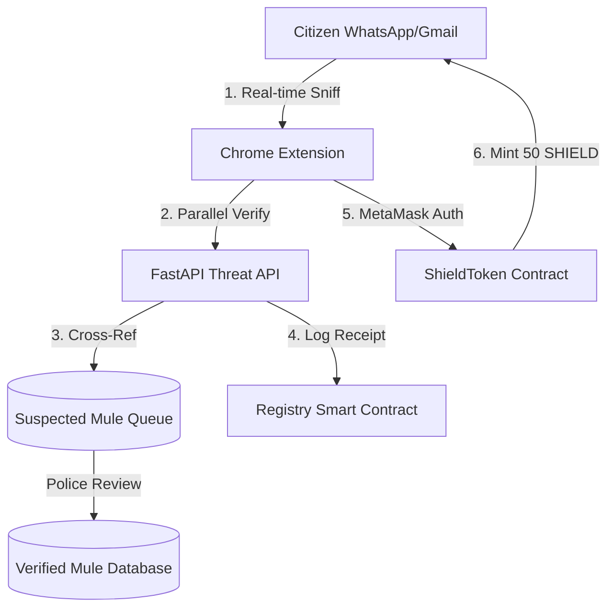

# 🛡️ CyberShield: Crowdsourced Threat Intelligence & Tamper-Evident Evidence Logging

> **CyberShield transforms scattered citizen reports into a tamper-evident, correlated cyber intelligence network. AI identifies threats, blockchain preserves evidence integrity, and the police dashboard connects related incidents to expose larger fraud campaigns.**

---

## 📖 Table of Contents
1. [Project Overview](#-project-overview)
2. [Key Features](#-key-features)
3. [System Architecture](#-system-architecture)
4. [Tech Stack](#-tech-stack)
5. [Installation & Setup](#-installation--setup)
6. [How to Push to Your GitHub Repository](#-how-to-push-to-your-github-repository)

---

## 🌟 Project Overview
CyberShield is a state-of-the-art cyber defense system built for the **Prakasam District Police Hackathon 2026**. It solves the limitations of traditional, reactive cyber-policing portals by implementing a two-way defense pipeline:
* **For Citizens:** A lightweight browser extension that scans WhatsApp Web and Gmail to block phishing domains, fake UPI IDs, and fraudulent QR codes in real time, rewarding active reporting with **SHIELD ERC-20 tokens** directly to their MetaMask wallets.
* **For Police Cells:** A centralized React.js dashboard showing real-time scam hotspots, automatically linking isolated cases that share duplicate targets, and hosting a review pipeline for verified mule accounts.

---

## 🎯 Key Features

*   **Proactive Interception:** Mutation observers detect and flag threats inside incoming chat/email elements *before* any money is transferred.
*   **Automatic UPI Linkification:** Translates plain text `upi://` protocol strings into active, clickable blue hyperlinks.
*   **Tamper-Evident Audits:** Logs SHA-256 evidence hashes onto an Ethereum blockchain registry to preserve the chain of custody.
*   **Gamified Rewards:** Mints **50 SHIELD** ERC-20 utility tokens to MetaMask for verified, unique citizen reports.
*   **Campaign Correlation:** Automatically draws linkages between distinct cases in Guntur, Ongole, and Guntur sharing identical targets.
*   **Suspected Mule Queue:** Incorporates a staging queue for manual police review before accounts are registered in the global blacklist.
*   **Privacy-First Hotmaps:** Uses approximate reporter network locations (resolved from public IP blocks) to build hotmaps while respecting user privacy.

---

## 🏗️ System Architecture



---

## 💻 Tech Stack

*   **Frontend (Dashboard):** React.js (Vite), Leaflet.js Maps, TailwindCSS.
*   **Browser Guard (Extension):** Vanilla JavaScript Content Scripts, Manifest V3.
*   **Backend (Engine):** FastAPI (Python 3.10+), SQLAlchemy ORM, Web3.py.
*   **Database:** SQLite / PostgreSQL cache.
*   **Web3 (Ledger):** Solidity (0.8.20), Hardhat Node, MetaMask API (JSON-RPC).

---

## 🚀 Installation & Setup

Follow these steps to run the complete CyberShield environment locally:

### 1. Pre-requisites
*   Install [Node.js](https://nodejs.org/) (v18+)
*   Install [Python](https://www.python.org/) (v3.10+)
*   Install [MetaMask Extension](https://metamask.io/) in your browser.

---

### 2. Run the Blockchain Node & Deploy Contracts
1. Navigate to the contract folder:
   ```bash
   cd blockchain
   ```
2. Install Hardhat dependencies:
   ```bash
   npm install
   ```
3. Start the local Ethereum test node:
   ```bash
   npm run node
   ```
4. In a new terminal, deploy the smart contracts to the local network:
   ```bash
   npm run deploy:local
   ```
   *Note: This will deploy both `CyberShieldRegistry.sol` and `ShieldToken.sol` and save their addresses/ABIs to the dashboard folder.*

---

### 3. Set Up & Run the FastAPI Backend
1. Navigate to the backend folder:
   ```bash
   cd backend
   ```
2. Initialize virtual environment:
   ```bash
   python -m venv venv
   venv\Scripts\activate   # Windows
   source venv/bin/activate # macOS/Linux
   ```
3. Install Python dependencies:
   ```bash
   pip install -r requirements.txt
   ```
4. Start the server:
   ```bash
   python main.py
   ```
   *The API will start running at `http://localhost:8090`.*

---

### 4. Run the Police Command Dashboard
1. Navigate to the dashboard folder:
   ```bash
   cd dashboard
   ```
2. Install npm dependencies:
   ```bash
   npm install
   ```
3. Start the development server:
   ```bash
   npm run dev
   ```
   *Open `http://localhost:5173` in your browser to view the policing dashboard.*

---

### 5. Load the Chrome Extension
1. Open Google Chrome and go to **`chrome://extensions/`**.
2. Enable **Developer mode** (toggle in the top-right corner).
3. Click **Load unpacked** in the top-left corner.
4. Select the **`extension`** folder from this project directory.
5. Log into MetaMask, switch your network to **Localhost 8545** (or **Hardhat Local Network**), and import one of Hardhat's pre-seeded private keys to receive test accounts.

---

## 📤 How to Push to Your GitHub Repository

If you want to upload this code to your own GitHub account, run these commands in your Git Bash or Terminal:

1. **Initialize Git in the project root folder:**
   ```bash
   git init
   ```
2. **Add all files to staging:**
   ```bash
   git add .
   ```
3. **Commit the files:**
   ```bash
   git commit -m "Initial commit: CyberShield End-to-End Release"
   ```
4. **Rename the default branch to main:**
   ```bash
   git branch -M main
   ```
5. **Add your new GitHub repository remote:**
   *Go to GitHub, create a new empty repository named `cybershield`, copy the URL, and run:*
   ```bash
   git remote add origin https://github.com/YOUR_GITHUB_USERNAME/cybershield.git
   ```
6. **Push the code to GitHub:**
   ```bash
   git push -u origin main
   ```
